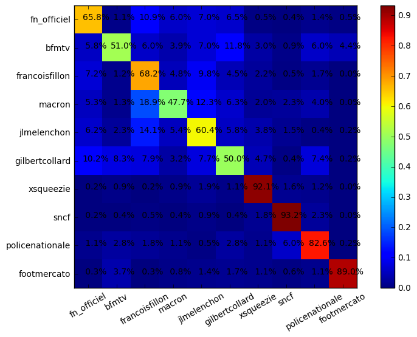

# Classification of Twitter Account using NLP

I did in 2016 a little bot in Python which parses Twitter feed and watch some given accounts. I wanted to use this data to train NN to classify Twitter accounts. 

I used LSTM networks (RNN) to achieve my goal. I had some fun classifying French Presidential Candidates to see similarities between some of them.

Here is the pipeline I came up with to analyze this data:

- Collect some tweets from Twitter
- **Embed the words** into vector space using *Word2Vec*
- Train **recurrent neural network like LSTM** on tweets (tweets are composed max of around 15 words so nice size for such a network)

I had nice results!

You can find (a bit messy) notebooks of my first researches. The clean version has been implemented but is used by a company I worked for.

Entertaining confusion matrix between French candidates:

(I should have used seaborn.clustermap to see interesting clusters ..)